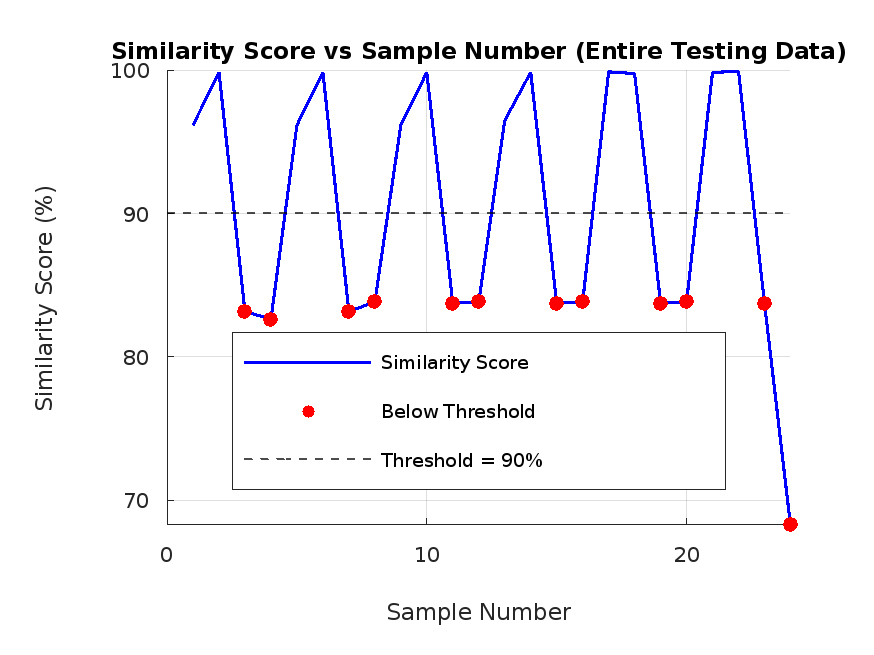

# AccelGuard

## Overview
AccelGuard is a MATLAB framework for real-time anomaly detection using accelerometer data. It analyzes three-axis readings to detect irregularities like free falls or machinery faults, with applications in wearable devices, industrial monitoring, robotics, and IoT systems, ensuring safety and operational efficiency.

## Features
- **Real-Time Anomaly Detection**: Quickly detects deviations from normal patterns in accelerometer data.
- **Multi-Axis Analysis**: Processes data from all three accelerometer axes (X, Y, Z) for comprehensive detection.
- **Visual Outputs**: Generates detailed graphs for identifying and interpreting anomalies.
- **Customizable Thresholds**: Allows users to tailor detection thresholds based on specific use cases.

## Applications
- **Free-Fall Detection**: Identifies sudden drops or falls in wearable devices.
- **Industrial Monitoring**: Detects machinery vibrations or abnormal movements for predictive maintenance.
- **Robotics**: Monitors irregular robotic movements to ensure operational safety.

## Installation
1. Clone the repository:
   ```bash
   git clone https://github.com/yourusername/AccelGuard.git
   ```
2. Open MATLAB and navigate to the cloned directory.
3. Ensure the required datasets are available in the working directory.

## Usage
1. Load the datasets into MATLAB:
   - Normal data (baseline).
   - Anomalous data (known deviations).
   - Testing data (evaluation dataset).

2. Run the main script:
   ```matlab
   run('AnomalyDetection.m')
   ```
3. View results:
   - Check the Command Window for intermediate outputs.
   - Analyze the generated graph for detected anomalies.

## File Structure
- **`AnomalyDetection.m`**: Main script for running the anomaly detection workflow.
- **Data Files**: Placeholder for datasets (replace with your actual files).
- **Results**: Includes visualizations like anomaly graphs.

## Example Graph
Below is an example of the output graph generated by AccelGuard:



The graph highlights detected anomalies as peaks or deviations from the baseline, making it easy to identify abnormal patterns.

## Contributing
Contributions are welcome! Feel free to fork this repository, make enhancements, and submit a pull request. Whether it’s improving the detection algorithm or adding new features, your input is valuable.

## License
This project is licensed under the MIT License. See the `LICENSE` file for details.

## Contact
For questions or feedback, feel free to open an issue or contact [your email/contact info].

